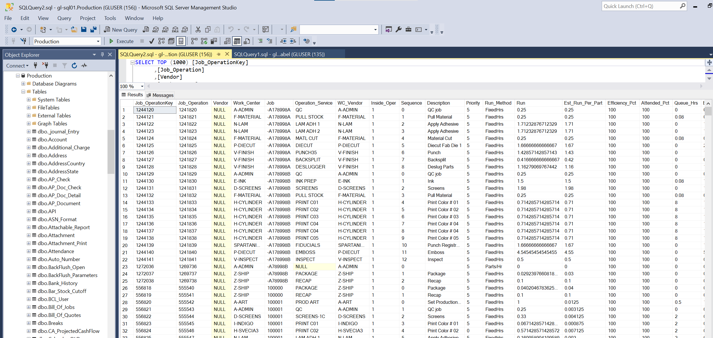
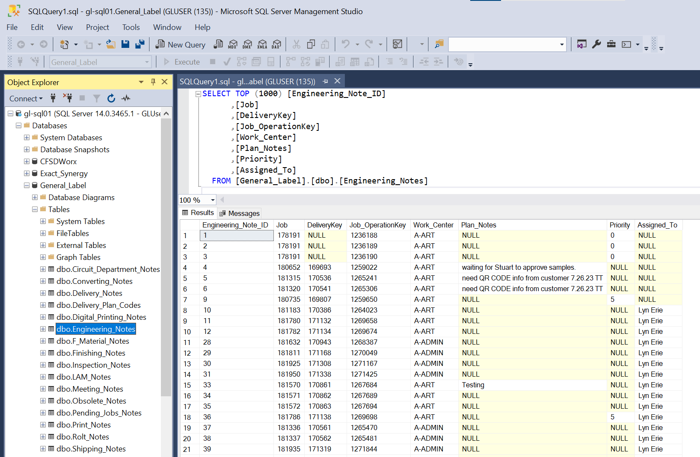
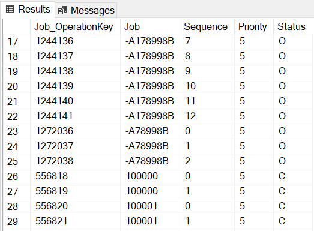
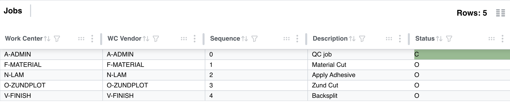
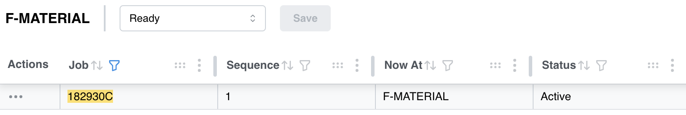
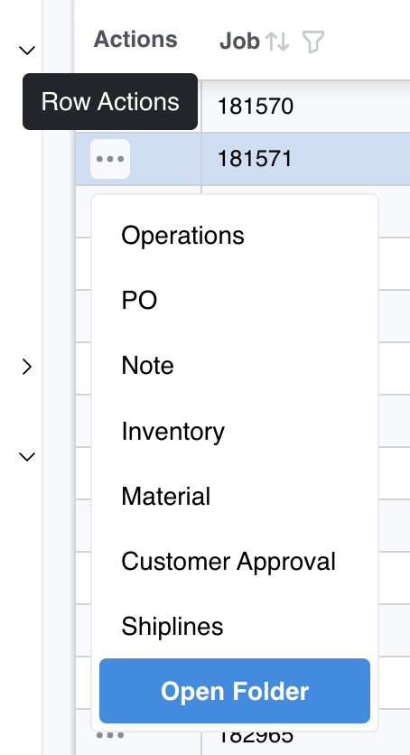
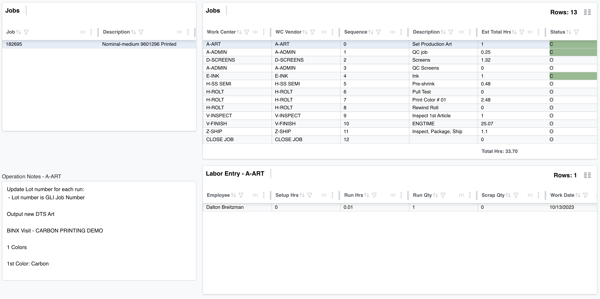
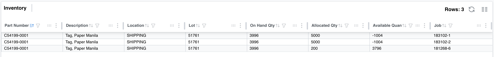
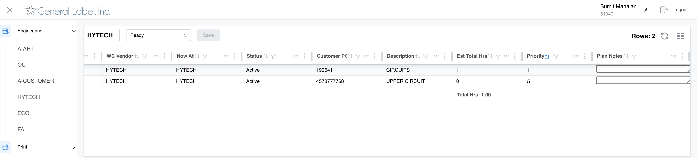
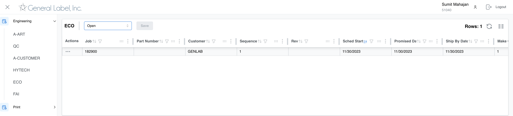

# **GLI App Technical Documentation**

### Authors: Spencer Erie

# **Table of Contents**
- [**GLI App Technical Documentation**](#gli-app-technical-documentation)
    - [Authors: Spencer Erie](#authors-spencer-erie)
- [**Table of Contents**](#table-of-contents)
- [**Overview**](#overview)
- [**Requirements and Resources**](#requirements-and-resources)
- [**Resources**](#resources)
- [**Feature Logic**](#feature-logic)
  - [SQL Server Databases](#sql-server-databases)
  - [Open and Ready Queue Logic](#open-and-ready-queue-logic)
  - [Action Button Features](#action-button-features)
    - [Operations](#operations)
    - [Purchase Orders](#purchase-orders)
    - [Note](#note)
    - [Inventory](#inventory)
    - [Material](#material)
    - [Customer Approval](#customer-approval)
    - [Shiplines](#shiplines)
  - [Open Folder](#open-folder)
  - [Delivery Queue Notes](#delivery-queue-notes)
- [**Changes and New Features**](#changes-and-new-features)
  - [User-Interface](#user-interface)
  - [New Pages](#new-pages)
    - [Example: HYTECH Vendor Queue](#example-hytech-vendor-queue)
      - [Client Side](#client-side)
      - [Server Side](#server-side)
    - [Example: ECO Work Center Queue](#example-eco-work-center-queue)
      - [Client Side](#client-side-1)

# **Overview**

The GL app uses ReactJS, a JavaScript library that builds front-end UI. Using ReactJS results in a faster program at the expense of readability for those who are not familiar with the framework. However once the structure of React is understood, developing larger applications becomes much more efficient. It also uses the Mantine UI library, which makes it possible to import and implement pre-existing UI components.

# **Requirements and Resources**

To edit the code of the GL App, you will first need to install Node.js, which can be found [here](https://nodejs.org/en). Then you will need to install the dependencies of the project through npm in the command prompt. Enter the following commands into your Command Prompt or Terminal while in the project directory: 
    
    npm install package.json

This will install all the npm packages being used in the project, however you may run into authentication errors depending on the permissions your terminal has.

The main packages that are in use are: 
- React: React is a widely used open-source component library originally developed by Facebook. It makes developing complex web applications a faster and clearer process.
  
- Mantine: Mantine is a library of pre-built UI components that can be imported and implemented specifically to your project. 

This project also uses TypeScript, a popular language that extends JavaScript by adding new types and structures that will be compiled back into JavaScript for the browser to read.

# **Resources**
This project was built using GitHub, a version control platform that keeps track of changes and stores different builds for the application for future deployment. There are separate repositories for the client and server side of the GLI App
- Client Side: [https://github.com/HarshaMurupudi/client.gl](https://github.com/HarshaMurupudi/client.gl) 
- Server Side: [https://github.com/HarshaMurupudi/server.gl](https://github.com/HarshaMurupudi/server.gl)
> Note that these still require the environment files to properly connect to the database, which are not stored on GitHub.

The GLI App uses the Mantine UI Library. For customization that is not covered in this document refer to their general documentation [here](https://mantine.dev/overview/), and the Mantine-React-Table documentation [here](https://www.mantine-react-table.com/docs).

# **Feature Logic**

## SQL Server Databases
The GLI App works with data coming from multiple databases on the GL servers. The first and one with the most information is the production database generated from JobBoss. It is accessed in SQL queries as [Production][DBO][...]. This holds almost all the information for every queue. In the query below, we are looking at the `[Production][dbo][Job_Operation]` table. 


  
However, the second database that we will look at is the General Label database, which is all in house unlike production. We use these for job notes and priorities. It is accessed in SQL queries [General_Label][dbo][...]. In this specific query, we are looking at the `[General_Label][dbo][Engineering_Notes]`table. When we use this table, the only thing we are writing to is `Priority`, `Plan_Notes`, and `Assigned_To`.
  

  
To understand how we read and write the General Label database, we will use Engineering notes as an example. First, here is the request query for our engineering queue.

```SQL
      SELECT * FROM [Production].[dbo].[Job_Operation] 
      WHERE Job IN 
      (
        SELECT DISTINCT(Job) FROM [Production].[dbo].[Job] 
        WHERE Status IN ('Active', 'Hold', 'Complete', 'Pending'
      ))
      AND Status in  ('O', 'S')
      ;

...

      SELECT *
      FROM (
        SELECT j.[Job], [Part_Number], [Customer], j.[Status], j.[Description], [Order_Quantity], [Completed_Quantity], [Released_Date], 
        j.Sched_Start, j.Make_Quantity, j.Note_Text, j.Sales_Code, jo.Work_Center, j.Rev, j.Quote,
        jo.WC_Vendor, jo.Sequence,
        del.Promised_Date,
        Plan_Notes, t3.Priority, t3.Assigned_To,
        ROW_NUMBER() OVER (PARTITION BY
        j.Job ORDER BY j.Sched_Start) AS row_number,
        jo.Est_Total_Hrs,
        del.DeliveryKey,
        jo.Job_OperationKey,
        j.Lead_Days,
        j.Customer_PO, j.Top_Lvl_Job
        FROM [dbo].[Job] AS j
        LEFT JOIN [dbo].[Job_Operation] jo on j.Job = jo.Job
        LEFT JOIN 
              (SELECT Job, Promised_Date, Requested_Date, DeliveryKey FROM [Production].[dbo].[Delivery]) AS del ON j.Job = del.Job
        LEFT JOIN
        (SELECT * FROM [General_Label].[dbo].[Engineering_Notes] ) AS t3
        ON 
          jo.Job = t3.Job
          AND jo.Job_OperationKey = t3.Job_OperationKey
          AND jo.Work_Center = t3.Work_Center
          AND (del.DeliveryKey = t3.DeliveryKey OR (del.DeliveryKey IS NULL AND t3.DeliveryKey IS NULL))
        WHERE j.[Job] IN (:jobIDs) AND jo.Work_Center = :wc
      ) AS t
        WHERE t.row_number = 1;
```
  
These are 2 queries, separated by an ellipsis. The first query gathers jobs from the Production database that are open or started, as the engineering queue only needs open jobs. The second query pulls from both the Production and the General Label database. There is further filtering done with these results which can be found at [server.gl/src/routes/work-centers/engineering.js](../server.gl/src/routes/work-centers/engineering.js), but we will analyze this second query more.  
  
For our purposes, the important part is '`(SELECT * FROM [General_Label][dbo][Engineering_Notes]) as t3 ON ...`'. The '`*`' indicates that we want to read all of the data from the table. The lines between `ON` and `WHERE...` matches the jobs from the Production and General Label databases. It checks that the operation keys, work centers, and delivery keys are the same. If a job does not have a delivery key, it's important to make sure neither have a delivery key. If one does, then they might be separate shipments. To see how this data is being used, read into the engineering feature at [client.gl/src/features/engineering/](../client.gl/src/features/engineering/).  
  
---

Now we can take a look at how we write to the General Label database, using the same example. First we need to define a model for the data we want to interact with. This can be found at [server.gl/src/models/EngineeringNotes.ts](../server.gl/src/models/EngineeringNotes.ts). The `primaryKey` gives each note a unique ID, and `autoIncrement` is enabled in the database table, so it has to be enabled here.
  
```TypeScript
const EngineeringNotes = db.define(
  "Engineering_Notes",
  {
    Engineering_Note_ID: {
      primaryKey: true,
      type: Sequelize.STRING,
      autoIncrement: true,
    },
    Job: {
      type: Sequelize.STRING,
    },
    DeliveryKey: {
      type: Sequelize.INTEGER,
    },
    Job_OperationKey: {
      type: Sequelize.INTEGER,
    },
    Work_Center: {
      type: Sequelize.STRING,
    },
    Plan_Notes: {
      type: Sequelize.STRING,
    },
    Priority: {
      type: Sequelize.STRING,
    },
    Assigned_To: {
      type: Sequelize.STRING,
    },
  },
  {
    tableName: "Engineering_Notes",
  }
);

module.exports = EngineeringNotes;
```  
  
Using this model, we can now write the SQL `patch` that will write to the database. This can be found at [server.gl/src/routes/notes.ts](../server.gl/src/routes/notes.ts). 
  
```TypeScript
const EngineeringNotes = require("../models/EngineeringNotes");

...

router.patch("/engineering/notes", async (req, res) => {
  try {
    const {
      data: { jobs },
    } = req.body;

    for (const {
      Job,
      DeliveryKey = null,
      Job_OperationKey = null,
      Plan_Notes = null,
      Work_Center = null,
      Assigned_To = null,
      Priority = null,
    } of jobs) {
      const condition = { Job, DeliveryKey, Job_OperationKey, Work_Center };
      const values = { Plan_Notes, Priority, Assigned_To };

      await upsert(EngineeringNotes, condition, values);
    }

    res.status(200).json({
      status: "success",
    });
  } catch (error: any) {
    console.log(error.message);

    res.status(400).json({
      status: "Error",
      message: `${error.message} & Ship By Date must not be empty`,
    });
  }
});
```
  
First, notice that we are passing the jobs through `req.body`. For each job, we assign each data type as null except for `Job`. This is because Job is the only value that cannot be null. We then separate the data into `conditions` and `values`. Conditions are values that are being pulled from the Production database and passed back into the General Label database, which is used for identification. The `upsert` function checks if this job already exists. If so, it will update the values that align with the conditions. If not, it will create a new row using both the conditions and values.  
  
If our notes were not all grouped together in that routing file, then we would also need to set the route for the app. However, all the notes are grouped together and routed into the app within [server.gl/src/index.ts](../server.gl/src/index.ts), as shown below.

```TypeScript
require("dotenv").config({ path: `.env.${process.env.NODE_ENV}` });
const express = require("express");
const cors = require("cors");

const { glDB } = require("./config/database");
const jobRoutes = require("./routes/jobs");
const auth = require("./routes/employee");
const noteRoutes = require("./routes/notes"); // Import notes route

...

glDB
  .authenticate()
  .then(() => console.log("DB Authenticated"))
  .catch((err: any) => {
    console.log("Error: " + err);
  });

const app = express();

app.use(cors());
app.use(express.json({ limit: "5mb" }));
app.use(jobRoutes);
app.use(auth);
app.use(noteRoutes); // Set routing for the app

...

app.listen(PORT, () => {
  console.log(`Server is up and listening on port ${PORT}`);
  console.log(process.env.DB_NAME, "env");
});
```

## Open and Ready Queue Logic
The open and ready queue job statuses are among the most vital features for managing work flow on the shop floor. Understanding the logic behind them is important to implement them properly and know how the queues are being displayed in our tables.  
  
First let's look at the broader status, open queue, and the logic behind it. The open status comes directly from the database. When a new job is added and approved, the status is automatically set as 'O' (or open) in the production database. When it is closed, the status becomes 'C' (or closed). These are the two major statuses in the database.  



Here you can see the Status of each job, but also take a look at the Sequence value for each job. This lets us implement our next topic, the ready queue. The ready queue is a smaller section of the open queue. If a job has a ready status, then it is active and open.  
  
The sequence value signifies which work center or department the job is currently at. When a sequence is closed at a work center, the job is still open and only the sequence changes in the database. However, if you look at a job with the operations feature, it will list all the sequences that have been completed. Take a look at the following job.  


  
The operations feature lists the work center for each sequence, and whether it has been completed or not. The sequences are taken by cross-referencing (LEFT-JOIN in SQL) the Job number and the Job_OperationKey in the database. In this example, the first sequence has been completed and has the corresponding 'C' status. This means that this job is now **ready** for the next sequence at the *F-MATERIAL* work center.  
  
If we go to the *F-MATERIAL* queue, we can now see that it is in the ready queue, as the corresponding work center for the current sequence '1' is *F-MATERIAL*. All ready jobs are open, so this will also show in the open queue for *F-MATERIAL*, as well as all the jobs that have yet to reach this work center.


  
Now that we understand the difference of the open and ready queues, we can look at how the SQL query is pulling these jobs to differentiate them. Take a look at the **Ready** jobs query below.

```SQL
      SELECT * FROM [Production].[dbo].[Job_Operation] 
      WHERE Job IN 
      (
        SELECT DISTINCT(Job) FROM [Production].[dbo].[Job] 
        WHERE Status IN ('Active', 'Hold', 'Complete', 'Pending'
      ))
      AND Status in  ('O', 'S')
      ;
          
...

      SELECT *
      FROM (
        SELECT j.[Job], [Part_Number], [Customer], j.[Status], j.[Description], [Order_Quantity], [Completed_Quantity], [Released_Date], 
        j.Sched_Start, j.Make_Quantity, j.Note_Text, j.Sales_Code, jo.Work_Center, j.Rev, j.Quote,
        jo.WC_Vendor, jo.Sequence,
        del.Promised_Date,
        Plan_Notes, t3.Priority,
        ROW_NUMBER() OVER (PARTITION BY
        j.Job ORDER BY j.Sched_Start) AS row_number,
        jo.Est_Total_Hrs,
        del.DeliveryKey,
        jo.Job_OperationKey,
        j.Lead_Days,
        j.Customer_PO, j.Top_Lvl_Job
        FROM [dbo].[Job] AS j
        LEFT JOIN [dbo].[Job_Operation] jo on j.Job = jo.Job
        LEFT JOIN 
              (SELECT Job, Promised_Date, Requested_Date, DeliveryKey FROM [Production].[dbo].[Delivery]) AS del ON j.Job = del.Job
        LEFT JOIN
        (SELECT * FROM [General_Label].[dbo].[F_Material_Notes] ) AS t3 
        ON 
          jo.Job = t3.Job
          AND jo.Job_OperationKey = t3.Job_OperationKey
          AND jo.Work_Center = t3.Work_Center
          AND (del.DeliveryKey = t3.DeliveryKey OR (del.DeliveryKey IS NULL AND t3.DeliveryKey IS NULL))
        WHERE j.[Job] IN (:jobIDs) AND jo.Work_Center = :wc
      ) AS t
        WHERE t.row_number = 1;
```
  
This query has a lot of information, but the important sections that differentiate the ready jobs from open is the following lines:
  
```SQL
SELECT * FROM (
  ROW_NUMBER() OVER (PARTITION BY
          j.Job ORDER BY j.Sched_Start) AS row_number,
) AS t
  WHERE t.row_number = 1;
```
  
Our query is only looking at open jobs, so this orders the remaining sequences by their scheduled start. If the first sequence in the list of open jobs corresponds to our work center, then the job is now ready. 

## Action Button Features

Each job row in our queues has an action button as the first column. There are various actions that we will look at below. While some of these actions are simple, others lead to entirely different pages. The only action that will have its own section is the [`Open Folder`](#open-folder) action button, as it has very different logic and requires the user to have a separate server running on their own computer.
  


---
  
### Operations

When the operations action button is clicked, it reroutes the user to a separate page that takes a deeper look into the sequences (or operations), for the job in that row. The image below shows an example of a job and a look into the features of this page. 
  

  
As you can see, the job we have selected has a lot of sequences on the right. These are being pulled from the `[Production][dbo][Job_Operation]` table from the database. Each job has multiple entries in this table, one for each sequence. Each sequence has a status, and estimated labor hours. The status is set by JobBoss when a user completes a job at a particular work center or sequence. The labor hours are also entered by JobBoss, and the routing for operation times can be found at [server.gl/src/routes/operationTime.ts](../server.gl/src/routes/operationTime.ts).  
  
Each operation has an estimated total hours, which combines estimated setup and run hours. When a specific operation is clicked on the top right table, it pulls that job by the work center and shows which employee worked on it, if it is completed. The following code block shows how this data is being called, which can be found at [client.gl/src/features/operations/index.js](../client.gl/src/features/operations/index.js)

  
```JavaScript
// client.gl/src/features/operations/index.js
<Grid.Col span={8}>
  <MantineDataTable
    tableKey={"Employee-Details"}
    title={`Labor Entry - ${selectedOperation.Work_Center || ""}`}
    columns={laborColumns}
    data={operationTimes}
    hasActionColumn={false}
    enableGrouping={false}
    tableProps={{
      enableEditing: false,
      getRowId: (row, index) => `${row.Job}_${index}`,
    }}
  />
</Grid.Col>

// client.gl/src/features/operations/store/actions.js
export const fetchOperationTimes = (operationId) => async (dispatch) => {
  try {
    dispatch(setOperationTimesLoading(true));

    const response = await baseAxios.get(`/operation-time/${operationId}`);

    dispatch(setOperationTimes(response.data.operationTimes));
  } catch (error) {
  } finally {
    dispatch(setOperationTimesLoading(false));
  }
};
```
  
A unique feature of the operations page is how it fetches notes. When an operation is selected, the notes from that work center are displayed on the bottom left panel. The following code block shows how this feature works, which can be found at [client.gl/src/features/operations/index.js](../client.gl/src/features/operations/index.js)
  
```JavaScript
<Grid.Col span={4}>
  <Textarea
    my={16}
    label={`Operation Notes - ${selectedOperation.Work_Center || ""}`}
    value={selectedOperation.Note_Text}
    autosize
  />
</Grid.Col>
```
  
`Note_Text` is coming straight from the operation in the `[Production][dbo][Job_Operation]` table, so we do not need a separate table to store and fetch these notes. 

---
### Purchase Orders
  
The purchase order action button is labelled as "`PO`" in the actions menu. This action fetches the Purchase Order PDF from the database. It functions similarly to the fetchPDF function that part numbers have, but with slightly different logic due to file structures. The following code block shows the `fetchPOPDF` function.   
```JavaScript
export const fetchPOPDF = (jobID) => async (dispatch) => {
  try {
    dispatch(setPDFLoading(true));

    // Check for avalability and file number
    const {
      data: { count },
    } = await baseAxios.get(`/part-number/${jobID}/po/info`);

    for (let i = 1; i <= count; i++) {
      const { data } = await baseAxios.get(`/part-number/${jobID}/po/${i}`, {
        headers: {
          "Content-Type": "multipart/form-data",
        },
        responseType: "arraybuffer",
      });

      const blob = new Blob([data], { type: "application/pdf" });
      const fileUrl = URL.createObjectURL(blob);

      await window.open(fileUrl);
    }
  } catch (error) {
    alert("no file");
  } finally {
    dispatch(setPDFLoading(false));
  }
};
```
  
First, it fetches the info for a part number's purchase order. This returns how many orders their are for that part. The next segment fetches all the PDFs for that part number by iterating through count, which is how many orders there are. If the info fetch returns nothing, then an alert pops up saying that there is no PO file.

---
### Note
  
The Note action button displays the Note Text from any given job. The `Note_Text` value is separate from work center notes, descriptions, and operation notes. This is directly from the `Production` database that is tied to JobBoss. The following code block shows the component behind this popup, which can be found at [client.gl/src/components/modal/index.js](../client.gl/src/components/modal/index.js)
  
```JavaScript
// client.gl/src/components/modal/index.js
< >
  <Modal
    opened={isModalOpen}
    onClose={() => setModalVisibility(false)}
    title="Note"
    centered
  >
    {/* Modal content */}
    <Textarea value={modalText} autosize />
  </Modal>
</>

// client.gl/src/components/mantine-data-table/index.tsx
const handleNoteActionBtn = (row) => {
    setModalVisibility(true);
    setModalText(row.original.Note_Text);
  };
```
  
Note that since the job from the `[Production][dbo][Job]` database contains `Note_Text`, the note is being called from the pre-existing value at "`row.original.Note_Text`".

---
### Inventory
  
The inventory action button reroutes the user to the delivery-queue-details page. This page shows inventory for the part that was selected. Take a look at the example below. Notice that while we are only looking at one part, there are multiple entries. This is because there are different job numbers associated with this part. 



---
### Material
  
---
### Customer Approval
  
---
### Shiplines
  
---
## Open Folder
  
## Delivery Queue Notes

# **Changes and New Features**

## User-Interface
While certain aspects of the UI in the Mantine library is difficult to manipulate, as it is pre-built, other aspects like font-face, and coloring can be changed within different components in the project. 
> Here is our renderApp function at [client.gl/src/App.tsx](src/App.tsx). <`MantineProvider` \\> provides a theme object, manages colors, and other CSS variables. You can create themes and inject them into the MantineProvider to change the styling of your Mantine based components. For example: 

```TypeScript
const theme = createTheme({
  fontFamily: 'Open Sans, sans-serif',
  primaryColor: 'cyan',
});

const renderApp = () => {
    if (userAuthLoadStatus) {
      return (
        <Provider store={store}>
          <MantineProvider
            theme={theme}
            withGlobalStyles
            withNormalizeCSS
          >
            <Router>
              <AppRoutes />
            </Router>
            <Notifications />
          </MantineProvider>
        </Provider>
      );
    } else {
      return <></>;
    }
  };
  ```
> As you can see, we can easily change the fontFamily for our app, which was changed in production from Open Sans to sans-serif.  
>   
> You can also see here that we have a <`Router` \\> and <`Notification` \\> component. The router component helps manage the various links and pages the GLI App has, such as the DeliveryQueue. The notification component is Mantine package that allows us to easily implement notifications on any page for different scenarios.  

## New Pages
React based applications allow a developer to expand their app out relatively easily compared to traditional HTML/JavaScript based web applications. In an HTML/JS based project, creating components can be quite bloated when you need to adjust them slightly for different needs. With React, however, you are creating HTML components using JavaScript (or TypeScript in our case), which can have parameters with more flexibility. 

---

### Example: HYTECH Vendor Queue
Many of our tables display job queues that filter based on the Work Center they are at in the GL Database. However, HYTECH is an outside Vendor, meaning it has to be filtered by WC_Vendor instead of Work_Center from the database. We'll use HYTECH as an example of how to create a new page using structures from other existing pages, and how to modify the SQL query to achieve the correct filtering. 

#### Client Side

> First, let's create the label on the main Sidebar of the app. The file can be found [here](src/components/sidebar/index.tsx).  
>   
> Here we have the structure for our sidebar labels and links on the Dashboard link. We want to put a new HYTECH button under Engineering, which has its own subclass of links beneath it. Create a new link under Engineering with the label "HYTECH" and the link "/hytech". Keep the link in mind, as we will be using that to redirect the application to the HYTECH page. 

```TypeScript
{ label: "Dashboard", icon: IconGauge, link: "/" },
  {
    label: "Admin",
    icon: IconNotes,
    initiallyOpened: true,
    links: [
      { label: "Job Review", link: "/contracts" },
      { label: "PO Review", link: "/po" },
      { label: "Tracking", link: "/tracking" },
      { label: "Production Meeting", link: "/productionMeeting" },
    ],
  },
  {
    label: "Engineering",
    icon: IconCalendarStats,
    initiallyOpened: false,
    links: [
      { label: "A-ART", link: "/a-art" },
      { label: "QC", link: "/qc" },
      { label: "A-CUSTOMER", link: "/a-customer" },
      { label: "HYTECH", link: "/hytech"}, // Add New HYTECH Label and Link here
    ],
  },
```

> We also need to add HYTECH to the Work Center Category Map for the `Now At` column in the jobs queue. This can be found at [client.gl/src/features/jobs/index.js](src/features/jobs/index.js)

```JavaScript
const CATEGORY_WC = "Now At";
  const categoryWCMap = {
    All: [],
    Engineering: [
      "A-ADMIN", 
      "A-ART",
      "A-CUSTOMER",
      "ECO",
      "HYTECH", // Add HYTECH Here
    ],
```

> Next, let's create the page file for HYTECH. Under `client.gl/src/pages/`, create a new folder "`hytech`", with an `index.jsx` file.  
>   
> Within this file, we will make a hytech component using the modular component <`Vendor `\\>. This is being imported from `client.gl/src/features/vendor`, which we will look at next. This function returns a <`div` \\> component that contains the <`Vendor` \\> component. The Vendor component takes in two arguments, the vendor name, and the table title. The title can be capitalized and formatted however we want, but the Vendor name (or `vendor={}`) must match the data that is in the database for the Vendor component to work. Finally, this function must be exported for another file to import it.

``` TypeScript
import React from 'react';

import Vendor from '../../features/vendor';

function Hytech() {
  return (
    <div>
      <Vendor vendor={'HYTECH'} title={'HYTECH'}/>
    </div>
  );
}

export default Hytech;
```

> If our HYTECH utilized the normal WorkCenterQueue component, our last step would be setting up the routing for the page. Since we need to modify our queue, we have more after this. This client side routing file can be found at [`client.gl/src/routes/public.tsx`](src/routes/public.tsx).  
>   
> Within this file, we first need to import the HYTECH page at the top of the file. Then we need to set up the routing components and URL path, which wraps the Hytech component that we have just created. 

```TypeScript
const Hytech = lazy(() => import("../pages/hytech"));

.
.
.

  {
    path: "/hytech",
    element: (
      <Suspense fallback={<div>Loading</div>}>
        <PrivateRoute>
          <AppLayout>
            <Hytech />  // Hytech component goes here
          </AppLayout>
        </PrivateRoute>
      </Suspense>
    ),
  },
```
> Now we can take a look at the Vendor component, which can be found [here](src/features/vendor/).  
>   
> Within this folder, there are a few files that build the structure of the Vendor component. For our example, we will simply copy the Engineering features folder and change the names of functions and variables. The folder structure of our folder will be as follows:

* [vendor/](src/features/vendor/)
  * [store/](src/features/vendor/store)
    * [actions.js](src/features/vendor/store/actions.js)
    * [index.js](src/features/vendor/store/index.js)
    * [reducer.js](src/features/vendor/store/reducer.js)
  * [columns.tsx](src/features/vendor/columns.tsx)
  * [index.jsx](src/features/vendor/index.jsx)

> First, let's look at `columns.tsx`, which is where you define which columns appear in your table. Each column is defined with an accessorKey, which should match the name of column in the database that you wish to display. There is also a header, which is the name that will appear on the column in our table. Here you can set certain options like enableEditing or set the filter type for the column.  
>   
> For our Vendor table, we need to add the WC_Vendor column. So, we make a new column in the order we want it to display, in this case it will appear to the right of Part_Number. We set the accessorKey to "WC_Vendor", but have the header be "WC Vendor" for readability. This data is coming from the database and users shouldn't be able to change it, so we turn editing off and give it the standard "multi-select" filter, as it's a simple text data type.  
>   
> The accessorFn is what retrieves the data from that specific row. It will either display the Vendor value from that row, or show nothing if there is no Vendor. This structure will work for most standard text data types, however if it needs to have further functions or styling, you will have to customize each cell of the column as shown under the Part Number column.

```TypeScript
const columns = [
    {
      accessorKey: "Job",
      header: "Job",
      enableEditing: false,
      filterVariant: "multi-select",
      accessorFn: (row: any) => {
        const Job = row.Job || "";
        return Job;
      },
    },
    {
      accessorKey: "Part_Number",
      header: "Part Number",
      filterVariant: "multi-select",
      enableEditing: false,
      accessorFn: (row: any) => {
        const Part_Number = row.Part_Number || "";
        return Part_Number;
      },
      mantineTableBodyCellProps: ({ cell }: { cell: any }) => ({
        onClick: () => {
          onFetchPDFClick(cell.getValue());
        },
      }),
      Cell: ({ cell, row }: { cell: any; row: any }) => ( // Further Customization
        <p
          style={{
            textDecoration: "underline",
            cursor: "pointer",
            margin: 0,
          }}
        >
          {cell.getValue()}
        </p>
      ),
    },
    {
      accessorKey: "WC_Vendor",
      header: "WC Vendor",
      enableEditing: false,
      filterVariant: "multi-select",
      accessorFn: (row: any) => {
        const WC_Vendor = row["WC_Vendor"] || "";
        return WC_Vendor;
      },
    },
```

> Next, we can take a look into the [store folder](src/features/vendor/store/).  
>   
> The files within the store directory work together to make API and network calls to retrieve data for our table. Since our Vendor component is very similar to the Work Center component, we can simply duplicate these files from the [Engineering store](src/features/engineering/store/), and replace any mentions of "engineering" (keeping the same letter cases) with "vendor". However, since Vendor is retrieving data from a different field in the database, we need to change the routing for retrieving jobs and posting notes.  
>   
> Beyond the naming scheme, the URL routes in our `baseAxios` functions are different. The `/vendor/open` and `/jobsByVendor/` URL routes are not decided here, but in the server side files, which can be found at `[server.gl/src/routes/work-centers/vendor.js](../server.gl/src/routes/work-centers/vendor.js)`, which we will look into later. However, the `vendor/notes` route is set in [server.gl/src/routes/notes.ts](../server.gl/src/routes/notes.ts), and importantly is missing the first forward slash, even though that slash is present in the route set on the server side.

```JavaScript
export const fetchOpenJobs = (partID) => async (dispatch) => {
  try {
    dispatch(setVendorLoading(true));

    const response = await baseAxios.get(`/vendor/open/${partID}`);
    dispatch(setOpenJobs(response.data.jobs));
  } catch (error) {
  } finally {
    dispatch(setVendorLoading(false));
  }
};

export const fetchReadyJobs = (partID) => async (dispatch) => {
  try {
    dispatch(setVendorLoading(true));

    const response = await baseAxios.get(`/jobsByVendor/${partID}`);
    dispatch(setReadyJobs(response.data.jobs));
  } catch (error) {
  } finally {
    dispatch(setVendorLoading(false));
  }
};

export const saveNotes = (jobs) => async (dispatch) => {
  try {
    dispatch(setVendorLoading(true));

   await baseAxios.patch('vendor/notes', 
      {
        data: {jobs},
        headers
      });
  } catch (error) {
    console.log(error);
    notifications.show({
      title: 'Error',
      message: error.response?.data?.message,
      color: 'red',
    })
  } finally {
    await delay(1200)
    dispatch(setVendorLoading(false));
  }
};
```

> Now we can work on `index.jsx`, which utilizes our `columns.tsx` and `/store` files that we set up. Once again we are mostly replacing the names of functions and variables that associate with our Vendor queue. So we replace mentions of `ws` (Work Center) with `vendor`, keeping letter casing. 


```JavaScript
function Vendor({
  openJobs,
  readyJobs,
  vendorLoading,
  vendor, // Vendor parameter, instead of "wc"
  title,
  fetchJobs,
  fetchPDF,
  saveNotes,
})

.
.
.

const columns = useMemo(
    () =>
      getColumns(
        fetchPDF,
        pathName,
        value,
        vendor,
        editedUsers,
        setEditedUsers,
        totalEstHours,
        getTableData
      ),
    [value, editedUsers, totalEstHours]
  );
```

---

#### Server Side

Before reading how we will setup our server side routing, you can take a look at the [Database section](#sql-database) to familiarize yourself with the databases we are working with.

> The first thing we will create on the server side is a Vendor Notes model, which will be found at [server.gl/src/models/notes/VendorNotes.ts](../server.gl/src/models/notes/VendorNotes.ts).  
>   
> Models are files that define the data types we are reading and writing from the database. The data types for Jobs are already defined in our database config, so we only need to define types for Vendor_Notes in the database. We will need to define Job, Job_OperationKey (which is being read from `[Production].[dbo].[Job_Operation]`), Vendor_Note_ID, Plan_Notes, and Priority (which is being read from and written to `[General_Label].[dbo].[Vendor_Notes]`).  
>   
> First we need to define the table as VendorNotes for routing, but give it the name "Vendor_Notes" so that it corresponds to the right table in the database. The Vendor_Note_ID is what the table is ordered by, so we set the options `primaryKey` and `autoIncrement` to true. These options need to also be set within the sql database as well. For defining the types, it is recommended to look at other models and set the type to the corresponding data value. If you are creating a data value that other queries don't use, make sure that the data type in the database is the same as what you define here.

```JavaScript
import Sequelize from "sequelize";
const { glNotesDB: db } = require("../../config/database");

const VendorNotes = db.define(
  "Vendor_Notes",
  {
    Vendor_Note_ID: {
      primaryKey: true,
      type: Sequelize.STRING,
      autoIncrement: true,
    },
    Job: {
      type: Sequelize.STRING,
    },
    Job_OperationKey: {
      type: Sequelize.INTEGER,
    },
    Plan_Notes: {
      type: Sequelize.STRING,
    },
    Priority: {
      type: Sequelize.STRING,
    },
  },
  {
    // don't add the timestamp attributes (updatedAt, createdAt)
    timestamps: false,

    // If don't want createdAt
    createdAt: false,

    // If don't want updatedAt
    updatedAt: false,

    tableName: "Vendor_Notes",
  }
);

module.exports = VendorNotes;
```

> Next we need to create our vendor route and query, which can be found at [`server.gl/src/routes/work-centers/vendor.js`](../server.gl/src/routes/work-centers/vendor.js).  
>   
> Once again we can copy another routing file, such as `finishing.js`, and modify it to achieve our vendor file. The router.get() function defines the URL path and array we will fill with the query from the database. Here you can see the routing for `/finishing/jobsByWorkCenter/:workCenterName`.  
>   
> Keep in mind that this query modification is very specific to this example. Other queues might require very different changes, but this is just to show how one might go about modifying a query to get the data you need.

```JavaScript
router.get("/finishing/jobsByWorkCenter/:workCenterName", async (req, res) => {
  try {
    const { workCenterName } = req.params;

    const jobs = await glDB.query(
      `
            SELECT * FROM [Production].[dbo].[Job_Operation] 
            WHERE Job IN 
            (
              SELECT DISTINCT(Job) FROM [Production].[dbo].[Job] 
              WHERE Status IN ('Active', 'Hold', 'Complete', 'Pending'
            ))
            AND Status in  ('O', 'S')
            ;
          `
    );

    let jobIds = [];
    let setOfJobs = [...new Set(jobs[0].map((cJob) => cJob.Job))];

    for (const job of setOfJobs) {
      const jobsWithData = jobs[0].filter((iJob) => {
        return iJob.Job == job;
      });
      const sortedJobs = jobsWithData.sort(compare);
      if (sortedJobs[0] && sortedJobs[0]["Work_Center"] == workCenterName) {
        jobIds.push(job);
      }
    }
```

> Since we are looking for Work Center Vendors instead, we will make our URL path `/jobsByVendor/:vendorName`, which corresponds to *ready jobs* by the Vendor that is entered. We also need to change the request parameter from workCenterName to vendorName, which is being used by `:vendorName` in the URL path. You can also see here that we had to change the sorting of jobs from `Work_Center` to `WC_Vendor`.

```JavaScript
router.get("/jobsByVendor/:vendorName", async (req, res) => {
  try {
    const { vendorName } = req.params;

    const jobs = await glDB.query(
      `
            SELECT * FROM [Production].[dbo].[Job_Operation] 
            WHERE Job IN 
            (
              SELECT DISTINCT(Job) FROM [Production].[dbo].[Job] 
              WHERE Status IN ('Active', 'Hold', 'Complete', 'Pending'
            ))
            AND Status in  ('O', 'S')
            ;
          `
    );

    let jobIds = [];
    let setOfJobs = [...new Set(jobs[0].map((cJob) => cJob.Job))];

    for (const job of setOfJobs) {
      const jobsWithData = jobs[0].filter((iJob) => {
        return iJob.Job == job;
      });
      const sortedJobs = jobsWithData.sort(compare);
      if (sortedJobs[0] && sortedJobs[0]["WC_Vendor"] == vendorName) {
        jobIds.push(job);
      }
    }
```

> Now let's look at the main query job queries, which depending on what you need to get from the database, will be the hardest part about creating a new queue page. The following is the `finishing/jobsByWorkCenter/:workCenterName` query.

```JavaScript
await glDB.query(
            `
          SELECT *
          FROM (
            SELECT j.[Job], [Part_Number], [Customer], j.[Status], j.[Description], [Order_Quantity], [Completed_Quantity], [Released_Date], 
            j.Sched_Start, j.Make_Quantity, j.Note_Text, j.Sales_Code, jo.Work_Center, j.Rev,
            jo.WC_Vendor, jo.Sequence,
            del.Promised_Date,
            Plan_Notes, t3.Priority,
            ROW_NUMBER() OVER (PARTITION BY
            j.Job ORDER BY j.Sched_Start) AS row_number,
            jo.Est_Total_Hrs,
            del.DeliveryKey,
            jo.Job_OperationKey,
            j.Lead_Days,
            j.Customer_PO, j.Top_Lvl_Job
            FROM [dbo].[Job] AS j
            LEFT JOIN [dbo].[Job_Operation] jo on j.Job = jo.Job
            LEFT JOIN 
                  (SELECT Job, Promised_Date, Requested_Date, DeliveryKey FROM [Production].[dbo].[Delivery]) AS del ON j.Job = del.Job
            LEFT JOIN
            (SELECT * FROM [General_Label].[dbo].[Finishing_Notes] ) AS t3 
            ON 
              jo.Job = t3.Job
              AND jo.Job_OperationKey = t3.Job_OperationKey
              AND jo.Work_Center = t3.Work_Center
              AND (del.DeliveryKey = t3.DeliveryKey OR (del.DeliveryKey IS NULL AND t3.DeliveryKey IS NULL))
            WHERE j.[Job] IN (:jobIDs) AND jo.Work_Center = :wc
          ) AS t
            WHERE t.row_number = 1;
          `,
            {
              replacements: {
                jobIDs: jobIds,
                wc: workCenterName,
              },
            }
          )
```

> What we want to change is located in the last `LEFT JOIN` of the query. Specifically the `[Finishing_Notes]`, and `jo.Work_Center = :wc`. In our Vendor queue, we don't need `jo.Work_Center` or to filter by `del.DeliveryKey`, so the following query will not have that data.

```JavaScript
await glDB.query(
        `
            SELECT *
            FROM (
              SELECT j.[Job], [Part_Number], [Customer], j.[Status], j.[Description], [Order_Quantity], [Completed_Quantity], [Released_Date], 
              j.Sched_Start, j.Make_Quantity, j.Note_Text, j.Sales_Code, jo.Work_Center, j.Rev,
              jo.WC_Vendor, jo.Sequence,
              del.Promised_Date,
              Plan_Notes, t3.Priority,
              ROW_NUMBER() OVER (PARTITION BY
              j.Job ORDER BY j.Sched_Start) AS row_number,
              jo.Est_Total_Hrs,
              del.DeliveryKey,
              jo.Job_OperationKey,
              j.Lead_Days,
              j.Customer_PO, j.Top_Lvl_Job
              FROM [dbo].[Job] AS j
              LEFT JOIN [dbo].[Job_Operation] jo on j.Job = jo.Job
              LEFT JOIN 
                    (SELECT Job, Promised_Date, Requested_Date, DeliveryKey FROM [Production].[dbo].[Delivery]) AS del ON j.Job = del.Job
              LEFT JOIN
              (SELECT * FROM [General_Label].[dbo].[Vendor_Notes] ) AS t3 // [Finishing_Notes] turns into [Vendor_Notes]
              ON 
                jo.Job = t3.Job
                AND jo.Job_OperationKey = t3.Job_OperationKey
              WHERE j.[Job] IN (:jobIDs) AND jo.WC_Vendor = :vendor // jo.Work_Center is changed to jo.WC_Vendor and is given :vendor
            ) AS t
              WHERE t.row_number = 1;
            `,
        {
          replacements: {
            jobIDs: jobIds,
            vendor: vendorName,
          },
        }
      )
```

> As you can see, we changed 
> - `[Finishing_Notes]` into `[Vendor_Notes]` (which comes from the `[General_Label]` database)
> - `jo.Work_Center = :wc` into `jo.WC_Vendor = :vendor`
> - `wc: workCenterName` into `vendor: vendorName`

> For the open jobs query, we make the same changes. We make a similar change to the URL, just making sure we keep it simple and in mind for when we create the client side routing for this data. The following is the new `/vendor/open/:vendorName` query.

```JavaScript
router.get("/vendor/open/:vendorName", async (req, res) => {
  try {
    const { vendorName } = req.params;

    const jobs = await glDB.query(
      `
          select 
            j.Job, j.Customer, Part_Number, j.Status, j.Description, 
            j.Sched_Start, j.Make_Quantity, j.Note_Text,
            j.Sales_Code, jo.Work_Center, jo.Status, jo.Sequence, j.Rev,
            jo.WC_Vendor,
            del.Promised_Date,
            j.Lead_Days,
            Plan_Notes, t3.Priority,
            (del.Promised_Date - j.Lead_Days) AS Ship_By_Date,
            jo.Est_Total_Hrs,
            del.DeliveryKey,
            jo.Job_OperationKey,
            j.Lead_Days,
            j.Customer_PO, j.Top_Lvl_Job
          from [Production].[dbo].[Job] as j
          left join
          (select * from [Production].[dbo].[Job_Operation] where Status in  ('O', 'S')) as jo
          on j.Job = jo.Job
          LEFT JOIN 
            (SELECT Job, Promised_Date, Requested_Date, DeliveryKey FROM [Production].[dbo].[Delivery]) AS del ON j.Job = del.Job
          LEFT JOIN
          (SELECT * FROM [General_Label].[dbo].[Vendor_Notes] ) AS t3 
          ON 
            jo.Job = t3.Job
            AND jo.Job_OperationKey = t3.Job_OperationKey
            AND (del.DeliveryKey = t3.DeliveryKey OR (del.DeliveryKey IS NULL AND t3.DeliveryKey IS NULL))
          where 
          j.status in ('Active','Hold', 'Pending', 'Complete') 
          AND 
          jo.WC_Vendor = :vendor;
        `,
      {
        replacements: {
          vendor: vendorName,
        },
      }
    );
```

> We also need to change sorting from `"Work_Center"` to `"WC_Vendor"`.

```JavaScript
const sortedJobs = jobsWithData.sort(compare);
      if (sortedJobs.length > 0) {
        job["Now At"] = sortedJobs[0]["WC_Vendor"];
      }
```

> Next we need to route our Vendor notes to the database. This can be found at [server.gl/src/routes/notes.ts](../server.gl/src/routes/notes.ts). Set the `VendorNotes` model with the `require()` function at the top of the file, and write the patch at least after the `upsert` import. Choose a simple URL such as `/vendor/notes`, and keep it in mind for when we route the notes on the client side. When we do route it on the client side, remember to remove the first forward slash so that the path is `vendor/notes`.  
>   
> Within this router patch, we need to set our data to null, and pass them to the constants condition and values appropriately. `Plan_Notes` and `Priority` are the values that a user is allowed to change, so those are passed into the value constant, while the other data types are passed into the condition constant. Also note that we are passing `VendorNotes` into the `upsert()` function.

```TypeScript
const VendorNotes = require("../models/notes/VendorNotes");

.
.
.

router.patch("/vendor/notes", async (req, res) => {
  try {
    const {
      data: { jobs },
    } = req.body;
    for (const {
      Job,
      DeliveryKey = null,
      Plan_Notes = null,
      Job_OperationKey = null,
      Priority = null,
    } of jobs) {
      const condition = { Job, DeliveryKey, Job_OperationKey };
      const values = { Plan_Notes, Priority };

      await upsert(VendorNotes, condition, values);
    }

    res.status(200).json({
      status: "success",
    });
  } catch (error: any) {
    console.log(error);

    res.status(400).json({
      status: "Error",
      message: `${error.message}`,
    });
  }
});
```

> Our last step on the server side is opening this route to the application. This can be found at [src/index.ts](../server.gl/src/index.ts). At the top of the file, we import the vendor routing. After the `app` constant is declared, we call `app.use()` to open the route. 

```TypeScript
const vendorJobs = require("./routes/work-centers/vendor");

.
.
.

const app = express();

app.use(vendorJobs);
```

> If you have completed both the client and server side steps to create a new queue page, you should now see it on the development server you have set up. If not, you need to check the error logs for the Node.Js instances for the client and server. Some errors will not directly show up with Node.Js, and you will have to insert console logs to find where and what the error occurring is. 



---

### Example: ECO Work Center Queue

> Adding a new Work Center queue is fairly simple, as there is already a <`WorkCenterQueue` \\> component that we will utilize. What you will have to keep in mind is which route you will be using (engineering, meeting, print, etc). In this case we will be adding the ECO Queue to Engineering. Using an existing route means we will not have to make any changes to the server side code. 

#### Client Side

> First, let's create the label on the main Sidebar of the app. The file can be found [here](src/components/sidebar/index.tsx).  
>   
> Here we have the structure for our sidebar labels and links on the Dashboard link. We want to put a new ECO button under Engineering, which has its own subclass of links beneath it. Create a new link under Engineering with the label "ECO" and the link "/eco". Keep the link in mind, as we will be using that to redirect the application to the HYTECH page.

```TypeScript
{ label: "Dashboard", icon: IconGauge, link: "/" },
  {
    label: "Admin",
    icon: IconNotes,
    initiallyOpened: true,
    links: [
      { label: "Job Review", link: "/contracts" },
      { label: "PO Review", link: "/po" },
      { label: "Tracking", link: "/tracking" },
      { label: "Production Meeting", link: "/productionMeeting" },
    ],
  },
  {
    label: "Engineering",
    icon: IconCalendarStats,
    initiallyOpened: false,
    links: [
      { label: "A-ART", link: "/a-art" },
      { label: "QC", link: "/qc" },
      { label: "A-CUSTOMER", link: "/a-customer" },
      { label: "HYTECH", link: "/hytech"},
      { label: "ECO", link: "/eco"}, // Add ECO link here
    ],
  },
```

> We also need to add ECO to the Work Center Category Map for the `Now At` column in the jobs queue. This can be found at [client.gl/src/features/jobs/index.js](src/features/jobs/index.js)

```JavaScript
const CATEGORY_WC = "Now At";
  const categoryWCMap = {
    All: [],
    Engineering: [
      "A-ADMIN", 
      "A-ART",
      "A-CUSTOMER",
      "HYTECH",
      "ECO", // Add ECO Here
    ],
```

> Next, let's create the page file for ECO. Under `client.gl/src/pages/`, create a new folder "`eco`", with an `index.jsx` file.  
>   
> Within this file, we will create an Eco component using the modular component <`Engineering` \\> (if you are routing through print, use <`Print` \\> instead). The Engineering component takes in two arguments, the work center name, and the table title. The title can be capitalized and formatted however we want, but the Work Center (or `wc={}`) name must match the data that is in the database for the Engineering component to work, which is "ECO" in this case. Finally, this function must be exported for another file to import it.

```JavaScript
import React from 'react';

import Engineering from '../../features/engineering';

function ECO() {
  return (
    <div>
      <Engineering wc={'ECO'} title={'ECO'}/>
    </div>
  );
}

export default ECO;
```

> Our last step is setting up the client side routing, which can be found in [`client.gl/src/routes/public.tsx`](src/routes/public.tsx).  
>   
> Within this file, we first need to import the ECO page at the top of the file. Then we need to set up the routing components and URL path, which wraps the Eco component that we have just created. 

```TypeScript
const Eco = lazy(() => import("../pages/eco"));

.
.
.

  {
    path: "/eco",
    element: (
      <Suspense fallback={<div>Loading</div>}>
        <PrivateRoute>
          <AppLayout>
            <Eco />  // Eco component goes here
          </AppLayout>
        </PrivateRoute>
      </Suspense>
    ),
  },
```



---